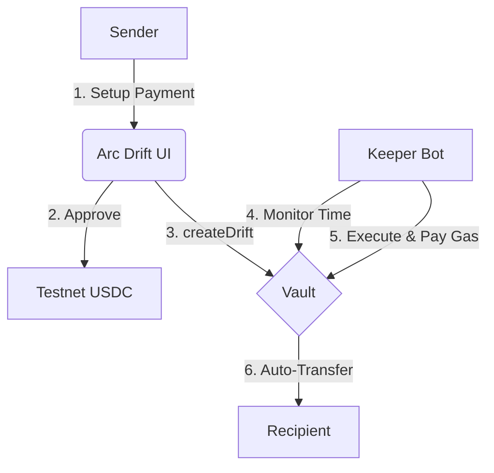

# Arc Drift 🌊
**Decentralized Escrow & Continuous Streaming Protocol on the ARC Network**

Arc Drift is an on-chain, non-custodial payment protocol that allows users to send delayed, continuous, and cancelable micro-payments using USDC. Built for the ARC Testnet, it features a smart contract vault and an automated off-chain Keeper Bot network that executes transactions on behalf of recipients—enabling a true zero-gas claiming experience.

---

## 📖 Overview

Standard blockchain transactions are instantaneous and final. Arc Drift introduces **programmable time** into token transfers. 

When a user initializes a Drift, their USDC is locked in the `ArcDriftCore` smart contract. The funds are then distributed according to the chosen mathematical rule. To solve the UX friction of requiring recipients to pay gas to "claim" their funds, our off-chain Keeper Bot automatically covers the ARC gas fee to execute mature Drifts.

---

## 🏗️ System Architecture

### High-Level Flow

